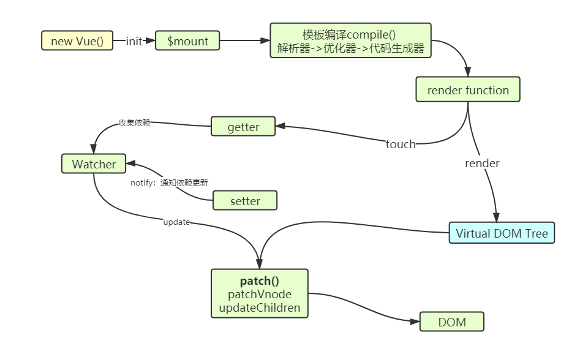
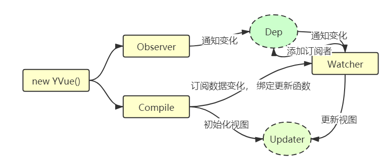

# vue工作机制



## 初始化

​	在 new Vue() 时会调用_init()进行初始化，会初始化各种实例方法、全局方法、执行一些生命周期、初始化
props、data等状态。其中最重要的是data的「响应化」处理。
初始化之后调用 $mount 挂载组件，主要执行编译和首次更新。

## 编译

模板编译分为三个阶段：
1. parse：使用正则解析template中的vue的指令(v-xxx) 变量等等 形成抽象语法树AST
2. optimize：标记一些静态节点，用作后面的性能优化，在diff的时候直接略过
3. generate：把第一部生成的AST 转化为渲染函数 render function

## 更新

​	数据修改触发setter，然后监听器会通知进行修改，通过对比新旧vdom树，得到最小修改，就是patch ，然后只需要把这些差异修改即可。

# 实现YVue

## 工作原理



## 初始化

首先将数据响应化--> 编译模板初始化视图

```js
  constructor(options) {
    // 1. 处理选项options
    this.$options = options; // $ 与外部变区分
    // 2. 数据响应化
    this.$data = options.data;
    this.observe(this.$data);
    // 3. 模板编译
    new Compile(options.el, this);
    // 4. 执行生命周期钩子
    if (options.created) {
      options.created.call(this);
    }
  }
```


### 数据响应化-Observer

### observe

作用：将传入的数据响应化（将数据中所有属性转换成getter/setter 的形式）

实现原理：遍历数据中所有属性，通过Object.defineProperty 将属性转化成getter/setter 的形式来追踪数据变化。

```js
  /**
   * 使传递进来的对象响应化
   * @param {Object} value 
   */
  observe(value) {
    // console.log('observe value=', value);
    if (!value || typeof value !== 'object') {
      return;
    }
    // 将value 中所有属性转换成getter/setter的形式
    Object.keys(value).forEach(key => {
      // 对key做响应式处理， 将属性转换成getter/setter的形式
      this.defineReactive(value, key, value[key])
      //app.$data.test ==> app.test 代理
      this.proxyData(key);
    })
  }

```

#### defineReactive

作用：将obj[key]属性转换成getter/setter的形式 

实现原理： 在对象obj 上定义响应式属性key的get() 和set()

- 首先为属性key 创建管理依赖的工具` const dep = new Dep()`

- 调用Object.defineProperty() 把obj 属性key转换成getter/setter的形式	

- 在getter中 把依赖(Watcher实例) 收集到dep 中，

- 在setter中执行`dep.notify()` 去通知(Watcher实例) 更新。

```js
  /**
   * 将obj[key]属性转换成getter/setter的形式 
   * @param {Object} obj 
   * @param {*} key 
   * @param {*} val 
   */
  defineReactive(obj, key, val) {
    if (typeof val === 'object') {
      // 递归侦测所有key
      this.observe(val);
    }

    // 创建Dep实例：Dep和key一对一对应
    const dep = new Dep();
    // 给obj定义属性
    Object.defineProperty(obj, key, {
      get() {
        // 收集依赖到Dep
        // 将Dep.target指向的Watcher实例加入到Dep中
        Dep.target && dep.depend()
        // 返回obj[key]的值
        return val
      },
      set(newVal) {
        if (newVal !== val) {
          // 设置新值
          val = newVal
          // 通知依赖更新
          dep.notify()
        }
      }
    })
  }
```


#### proxyData

作用：将vm.$data代理到vm 上 vm[key] 等价于 vm.$data[key]

```js
  /**
   * 代理到vm，在vue根上定义属性代理data中的数据
   * @param {*} key 
   */
  proxyData(key) {
    Object.defineProperty(this, key, {
      get() {
        return this.$data[key];
      },
      set(newVal) {
        this.$data[key] = newVal;
      }
    });
  }
```

### Dep

作用： 用来管理依赖（watcher实例）

实现：

- addSub() : 将依赖(Watcher实例) 添加到this.subs 数组中
- depend(): 依赖收集，将保存到Dep.target 中的Watcher实例 添加到this.subs 数组中
- notify():触发依赖进行更新， 调用this.subs 数组中元素(watcher 实例)的update() ,通知watcher进行更新
- Dep.target: 是一个全局唯一的指定位置， 用来保存watcher实例

```js
// Dep:管理若干watcher实例，dep和key一对一关系
class Dep {
  constructor() {
    // 用来保存依赖(Watcher实例)
    this.subs = []
  }
  /**
   * 将依赖(Watcher实例) 添加到this.subs 数组中
   * @param {Watcher实例} sub 
   */
  addSub(sub) {
    this.subs.push(sub)
  }
  // 依赖收集
  depend() {
    if (Dep.target) {
      Dep.target.addDep(this)
    }
  }
  // 触发依赖进行更新
  notify() {
    const subs = this.subs.slice()
    console.log('notify subs=', subs);
    for (let i = 0, l = subs.length; i < l; i++) {
      subs[i].update() // 通知watcher进行更新
    }
  }
}
// 全局唯一的指定位置
Dep.target = null
```

### Watcher

原理：先把自己设置到全局唯一的指定位置(Dep.target), 然后读取数据， 触发数据的getter，从而触发依赖收集逻辑将自己收集到这个数据的依赖管理器(dep)中

实现：

- get() : 将当前Watcher实例指向Dep.target，读取属性key的值， 触发依赖收集逻辑将当前Watcher实例 收集到key的依赖管理器dep中

- update() : 当key的值发生变化，读取key的最新值， 然后调用回调函数

- addDep():  调用dep的addSub()将当前watcher实例添加到dep中

```js
// 保存ui中依赖，实现update函数更新
class Watcher {
  constructor(vm, key, cb) {
    this.vm = vm // Watcher有一个 vm 属性，表明它是属于哪个组件的
    this.key = key
    this.cb = cb
    this.value = this.get()
  }

  get() {
    // 将当前Watcher实例指向Dep.target
    Dep.target = this
    let value = this.vm[this.key];// 读一次key触发getter
    Dep.target = undefined
    return value
  }

  update() {
    const oldValue = this.value
    this.value = this.get()
    this.cb.call(this.vm, this.value, oldValue)
    // this.cb.call(this.vm, this.vm[this.key])
  }
  /**
   *  调用dep的addSub()将当前watcher实例添加到dep中
   * @param {Dep} dep 
   */
  addDep(dep) {
    dep.addSub(this)
  }
}
```


### 总结

```js
class YVue {
  constructor(options) {
    // 1. 处理选项options
    this.$options = options; // $ 与外部变区分
    // 2. 数据响应化
    this.$data = options.data;
    this.observe(this.$data);
    // 3. 模板编译
    new Compile(options.el, this);
    // 4. 执行生命周期钩子
    if (options.created) {
      options.created.call(this);
    }
  }
  /**
   * 使传递进来的对象响应化
   * @param {Object} value 
   */
  observe(value) {
    // console.log('observe value=', value);
    if (!value || typeof value !== 'object') {
      return;
    }
    // 将value 中所有属性转换成getter/setter的形式
    Object.keys(value).forEach(key => {
      // 对key做响应式处理， 将属性转换成getter/setter的形式
      this.defineReactive(value, key, value[key])
      //app.$data.test ==> app.test 代理
      this.proxyData(key);
    })
  }
  /**
   * 将obj[key]属性转换成getter/setter的形式 
   * @param {Object} obj 
   * @param {*} key 
   * @param {*} val 
   */
  defineReactive(obj, key, val) {
    if (typeof val === 'object') {
      // 递归侦测所有key
      this.observe(val);
    }

    // 创建Dep实例：Dep和key一对一对应
    const dep = new Dep();
    // 给obj定义属性
    Object.defineProperty(obj, key, {
      get() {
        // 收集依赖到Dep
        // 将Dep.target指向的Watcher实例加入到Dep中
        Dep.target && dep.depend()
        // 返回obj[key]的值
        return val
      },
      set(newVal) {
        if (newVal !== val) {
          // 设置新值
          val = newVal
          // 通知依赖更新
          dep.notify()
        }
      }
    })
  }
  /**
   * 代理到vm，在vue根上定义属性代理data中的数据
   * @param {*} key 
   */
  proxyData(key) {
    Object.defineProperty(this, key, {
      get() {
        return this.$data[key];
      },
      set(newVal) {
        this.$data[key] = newVal;
      }
    });
  }
}

// Dep:管理若干watcher实例，dep和key一对一关系
class Dep {
  constructor() {
    // 用来保存依赖(Watcher实例)
    this.subs = []
  }
  // 将依赖(Watcher实例) 添加到this.subs 数组中
  /**
   * 
   * @param {Watcher实例} sub 
   */
  addSub(sub) {
    this.subs.push(sub)
  }
  // 依赖收集
  depend() {
    if (Dep.target) {
      Dep.target.addDep(this)
    }
  }
  // 触发依赖进行更新
  notify() {
    const subs = this.subs.slice()
    console.log('notify subs=', subs);
    for (let i = 0, l = subs.length; i < l; i++) {
      subs[i].update() // 通知watcher进行更新
    }
  }
}
// 全局唯一的指定位置
Dep.target = null
// 保存ui中依赖，实现update函数更新
class Watcher {
  constructor(vm, key, cb) {
    this.vm = vm // Watcher有一个 vm 属性，表明它是属于哪个组件的
    this.key = key
    this.cb = cb
    this.value = this.get()
  }

  get() {
    // 将当前实例指向Dep.target
    Dep.target = this
    let value = this.vm[this.key];// 读一次key触发getter
    Dep.target = undefined
    return value
  }

  update() {
    const oldValue = this.value
    this.value = this.get()
    this.cb.call(this.vm, this.value, oldValue)
    // this.cb.call(this.vm, this.vm[this.key])
  }
  /**
   *  调用dep的addSub()将当前watcher实例添加到dep中
   * @param {Dep} dep 
   */
  addDep(dep) {
    dep.addSub(this)
  }
}
```


## 编译模板-Compile

### 初始化

```js
  constructor(el, vm) {
    this.$vm = vm;
    // 找到挂载目标
    this.$el = document.querySelector(el);
    if (this.$el) {
      //1. 提取宿主中模板内容到Fragment标签，dom操作会提高效率
      this.$fregment = this.node2Fregment(this.$el);
      console.log('this.$fregment = ', this.$fregment);
      //2. 编译模板内容，同时进行依赖收集
      this.compile(this.$fregment);
      console.log("after compile", this.$fregment);

      //3. 将编译结果追加至数组中-挂载
      this.$el.appendChild(this.$fregment);
    }
  }

```

- 首先找到挂载目标

  ```js
  this.$el = document.querySelector(el);
  ```

- 然后提取宿主中模板内容到Fragment标签，dom操作会提高效率

  ```js
  this.$fregment = this.node2Fregment(this.$el);
  ```

- 然后编译模板内容，同时进行依赖收集

  ```js
  this.compile(this.$fregment);
  ```

- 最后 将编译结果追加至数组中--挂载

  ```js
  this.$el.appendChild(this.$fregment);
  ```

#### node2Fregment

```js
  /**
   * 遍历el, 把里面的内容搬到一个fragment
   * @param {HTMLElement} el 
   */
  node2Fregment(el) {
    // 创建一个虚拟的节点对象，节点对象包含所有属性和方法。
    const fregment = document.createDocumentFragment();

    let child;
    while ((child = el.firstChild)) { // 像链表的->next
      //由于appendChild是移动操作
      fregment.appendChild(child);
    }
    return fregment;
  }
```

### compile

```js
  /**
   * 编译模板,同时进行依赖收集,替换插值表达式，处理指令和事件
   * @param {DocumentFragment} el 
   */
  compile(el) {
    //遍历el， 拿出所有child
    const childNodes = el.childNodes;
    Array.from(childNodes).forEach(node => {
      if (this.isElement(node)) { // 元素节点
        console.log('编译元素' + node.nodeName);
        // 如果是元素节点， 要处理指令y-xxx, 事件@xx
        this.compileElement(node);
      } else if (this.isInterpolation(node)) { // 插值
        console.log('编译文本' + node.textContent);
        this.compileTextNode(node);
      }
      //递归子元素
      if (node.childNodes && node.childNodes.length > 0) {
        this.compile(node);
      }
    });
  }
```

#### 判断节点类型

##### isElement

作用：判断是否是元素节点

```js
  /**
   * 判断是否是元素节点
   * @param {*} node 
   */
  isElement(node) {
    return node.nodeType === 1;
  }
```

##### isInterpolation

作用：判断是否是插值

```js
  /**
   * 判断是否是插值
   * @param {*} node 
   */
  isInterpolation(node) {
    return node.nodeType === 3 && /\{\{(.*)\}\}/.test(node.textContent);
  }

```

#### 初始化视图

##### compileElement

作用：编译元素节点

实现原理： 

- 如果元素中指令y-xx,  那么执行指令对应的函数

  - y-text 指令编译过程中对应执行text()
  - y-model 指令编译过程中对应执行model()
  - y-html 指令编译过程中对应执行html ()

   eg : 元素上有指令`<input type="text" y-model="name">`, 

- 如果元素中有事件@xx, 执行eventHandler 对

```js
  /**
   * 编译元素节点
   * @param {*} node 
   */
  compileElement(node) {
    // 查看node的特性中是否有指令y-xx 和事件 @xx
    const nodeAttrs = node.attributes;
    Array.from(nodeAttrs).forEach(attr => {
      //获取属性的名称和值 y-text="abc"
      const attrName = attr.name;
      const exp = attr.value;
      //指令: y-xx
      if (attrName.indexOf('y-') === 0) {
        const dir = attrName.substring(2);//text
        //执行指令对应的函数
        this[dir] && this[dir](node, this.$vm, exp);
      } else if (attrName.indexOf('@') === 0) {
        //事件 @click = "hadleClick"
        const eventName = attrName.substring(1);//click
        //exp : hadleClick
        this.eventHandler(node, this.$vm, exp, eventName);
      }
    })
  }

```

示例：

```html
<div id="app">
    <p y-text="name"></p>
    <input type="text" y-model="name">
    <div y-html="html"></div>
</div>
```

```js
const app = new YVue({
    el: '#app',
    data: {
        name: "ocean",
        age: 18,
        html: '<button>这是一个按钮</button>'
    },
})
```


###### text

作用：将解析的y-text 指令内容显示到视图上， 并通过`new Watcher`为指令表达式创建依赖， 将依赖收集到数据的依赖管理器dep中

例：

```js
<p y-text="name"></p>
```

将vm['name']  的值显示到视图上， 并且为vm['name'] 创建依赖(Watcher实例), 将依赖收集到vm['name']的依赖管理器dep中

```html
<p>ocean</p>
```

实现原理： 

- 调用update 更新视图， 同时 进行依赖收集

```js
/**
   * y-text
   * @param {*} node 
   * @param {YVue} vm ：YVue实例
   * @param {*} exp  : 表达式
   */
text(node, vm, exp) {
    this.update(node, vm, exp, 'text');
}
```

###### model

作用：将解析的y-model指令内容显示到视图上， 并通过`new Watcher`为指令表达式创建依赖， 将依赖收集到数据的依赖管理器dep中

例：

```js
<input type="text" y-model="name">
```

将vm['name']  的值显示到视图上， 并且为vm['name'] 创建依赖(Watcher实例), 将依赖收集到vm['name']的依赖管理器dep中

```html
<input type="text" value="ocean">
```

实现原理： 

- exp的值改变调用update 更新视图，同时进行依赖收集
- 添加'input' 事件监听器监听视图， 如果视图改变， 更新vm[exp]

```js
/**
   * y-model： 双向数据的绑定
   * @param {*} node 
   * @param {YVue} vm ：YVue实例
   * @param {*} exp  : 表达式eg： y-model="name" ==> exp 为 'name'
   */
model(node, vm, exp) {
    // 数值变了更新视图: data -> view
    this.update(node, vm, exp, 'model');
    // 在上视图改变数值，view -> data 
    node.addEventListener('input', e => {
        vm[exp] = e.target.value;
    });
}
```

```js
/**
   * y-html
   * @param {*} node 
   * @param {YVue} vm ：YVue实例
   * @param {*} exp  : 表达式
   */
html(node, vm, exp) {
    this.update(node, vm, exp, 'html');
}
```

###### eventHandler

实现原理：

​	当名字为eventName 的事件被触发时， 从vm.$options.methods 中获取名字为exp 的方法并将器添加到事件监听器。

```js
eventHandler(node, vm, exp, eventName) {
    //获取回调函数
    const fn = vm.$options.methods && vm.$options.methods[exp];
    if (eventName && fn) {
        node.addEventListener(eventName, fn.bind(vm)); //绑定当前组件实例
    }
}
```

示例


```html
<button @click="changeName">changeName</button>
```

```js
const app = new YVue({
    el: '#app',
    data: {
        name: "ocean",
        age: 18,
        html: '<button>这是一个按钮</button>'
    },
    methods: {
        changeName() {
            this.name = 'hello'
            this.age = 1
        }
    }
})
```

eventName： click

exp：changeName

为 click 事件添加监听器， 回调函数为changeName

##### compileTextNode

实现原理： 调用update()将解析的插值显示到视图上， 并通过`new Watcher`为指令表达式创建依赖， 将依赖收集到数据的依赖管理器dep中。

```js
  /**
   * 把插值表达式替换为实际的内容
   * @param {*} node 
   */
  compileTextNode(node) {
    //获取正则表达式中匹配的内容
    //{{xxx}} RegExp.$1 是匹配分组的部分
    console.log('compileTextNode RegExp.$1=', RegExp.$1);
    //node.textContent = this.$vm[RegExp.$1];
    const exp = RegExp.$1;
    this.update(node, this.$vm, exp, 'text');
  }
```

### Update

实现原理：

-  调用Updator更新视图

- 然后创建Watcher，触发依赖收集流程， 将当前Watcher 收集到模板中获取的数据的dep 中

```js
  /**
   * new Vue({
   *  data: {
   *    name: 'ocean'
   *  }
   * })
   * 那么 exp为name
   * vm[exp]为'ocean'
   * @param {*} node 
   * @param {YVue} vm ：YVue实例
   * @param {*} exp  : 表达式
   * @param {String} dir :text, html, model
   */
  update(node, vm, exp, dir) {
    // dir：text ==> fn: textUpdator
    const fn = this[dir + 'Updator'];
    fn && fn(node, vm[exp]);
    // 依赖收集：创建Watcher，触发依赖收集流程， 将当前Watcher 收集到模板中获取的数据的dep 中
    new Watcher(vm, exp, function () {
      // 在监听exp的回调函数中调用 指令的更新函数
      fn && fn(node, vm[exp]);
    })
  }
```

#### textUpdator

作用： 将解析的y-text 指令内容显示到视图上

```js
textUpdator(node, value) {
    node.textContent = value;
}
```

#### modelUpdator

作用：  将解析的y-model指令内容显示到视图上

```js
modelUpdator(node, value) {
    node.value = value;
}
```

#### htmlUpdator

作用：  将解析的y-html指令内容显示到视图上

```js
htmlUpdator(node, value) {
    node.innerHTML = value;
}
```

#### 递归子元素

当前正在编译的节点有子节点， 那么需要递归的调用compile() 编译这些子节点

```js
//递归子元素
if (node.childNodes && node.childNodes.length > 0) {
    this.compile(node);
}
```

### 总结

```js
/**
 * 编译模板
 * 处理模板中插值表达式， 指令y-xx, 事件@xx
 */
class Compile {
  constructor(el, vm) {
    this.$vm = vm;
    // 找到挂载目标
    this.$el = document.querySelector(el);
    if (this.$el) {
      //1. 提取宿主中模板内容到Fragment标签，dom操作会提高效率
      this.$fregment = this.node2Fregment(this.$el);
      console.log('this.$fregment = ', this.$fregment);
      //2. 编译模板内容，同时进行依赖收集
      this.compile(this.$fregment);
      console.log("after compile", this.$fregment);

      //3. 将编译结果追加至数组中-挂载
      this.$el.appendChild(this.$fregment);
    }
  }

  /**
   * 遍历el, 把里面的内容搬到一个fragment
   * @param {HTMLElement} el 
   */
  node2Fregment(el) {
    // 创建一个虚拟的节点对象，节点对象包含所有属性和方法。
    const fregment = document.createDocumentFragment();

    let child;
    while ((child = el.firstChild)) { // 像链表的->next
      //由于appendChild是移动操作
      fregment.appendChild(child);
    }
    return fregment;
  }
  /**
   * 编译模板,同时进行依赖收集,替换插值表达式，处理指令和事件
   * @param {DocumentFragment} el 
   */
  compile(el) {
    //遍历el， 拿出所有child
    const childNodes = el.childNodes;
    Array.from(childNodes).forEach(node => {
      if (this.isElement(node)) { // 元素节点
        console.log('编译元素' + node.nodeName);
        // 如果是元素节点， 要处理指令y-xxx, 事件@xx
        this.compileElement(node);
      } else if (this.isInterpolation(node)) { // 插值
        console.log('编译文本' + node.textContent);
        this.compileTextNode(node);
      }
      //递归子元素
      if (node.childNodes && node.childNodes.length > 0) {
        this.compile(node);
      }
    });
  }
  /**
   * 判断是否是元素节点
   * @param {*} node 
   */
  isElement(node) {
    return node.nodeType === 1;
  }

  /**
   * 判断是否是插值
   * @param {*} node 
   */
  isInterpolation(node) {
    return node.nodeType === 3 && /\{\{(.*)\}\}/.test(node.textContent);
  }

  /**
   * 编译元素节点
   * @param {*} node 
   */
  compileElement(node) {
    // 查看node的特性中是否有指令y-xx 和事件 @xx
    const nodeAttrs = node.attributes;
    Array.from(nodeAttrs).forEach(attr => {
      //获取属性的名称和值 y-text="abc"
      const attrName = attr.name;
      const exp = attr.value;
      //指令: y-xx
      if (attrName.indexOf('y-') === 0) {
        const dir = attrName.substring(2);//text
        //执行指令对应的函数
        this[dir] && this[dir](node, this.$vm, exp);
      } else if (attrName.indexOf('@') === 0) {
        //事件 @click = "hadleClick"
        const eventName = attrName.substring(1);//click
        //exp : hadleClick
        this.eventHandler(node, this.$vm, exp, eventName);
      }
    })
  }

  eventHandler(node, vm, exp, eventName) {
    //获取回调函数
    const fn = vm.$options.methods && vm.$options.methods[exp];
    if (eventName && fn) {
      node.addEventListener(eventName, fn.bind(vm)); //绑定当前组件实例
    }
  }
  /**
   * y-text
   * @param {*} node 
   * @param {YVue} vm ：YVue实例
   * @param {*} exp  : 表达式
   */
  text(node, vm, exp) {
    this.update(node, vm, exp, 'text');
  }
  textUpdator(node, value) {
    node.textContent = value;
  }

  /**
   * y-model： 双向数据的绑定
   * @param {*} node 
   * @param {YVue} vm ：YVue实例
   * @param {*} exp  : 表达式eg： y-model="name" ==> exp 为 'name'
   */
  model(node, vm, exp) {
    // 数值变了更新视图: data -> view
    this.update(node, vm, exp, 'model');
    // 在上视图改变数值，view -> data 
    node.addEventListener('input', e => {
      vm[exp] = e.target.value;
    });
  }
  modelUpdator(node, value) {
    node.value = value;
  }

  /**
   * y-html
   * @param {*} node 
   * @param {YVue} vm ：YVue实例
   * @param {*} exp  : 表达式
   */
  html(node, vm, exp) {
    this.update(node, vm, exp, 'html');
  }
  htmlUpdator(node, value) {
    node.innerHTML = value;
  }

  /**
   * 把插值表达式替换为实际的内容
   * @param {*} node 
   */
  compileTextNode(node) {
    //获取正则表达式中匹配的内容
    //{{xxx}} RegExp.$1 是匹配分组的部分
    console.log('compileTextNode RegExp.$1=', RegExp.$1);
    //node.textContent = this.$vm[RegExp.$1];
    const exp = RegExp.$1;
    this.update(node, this.$vm, exp, 'text');
  }

  /**
   * new Vue({
   *  data: {
   *    name: 'ocean'
   *  }
   * })
   * 那么 exp为name
   * vm[exp]为'ocean'
   * @param {*} node 
   * @param {YVue} vm ：YVue实例
   * @param {*} exp  : 表达式
   * @param {String} dir :text, html, model
   */
  update(node, vm, exp, dir) {
    // dir：text ==> fn: textUpdator
    const fn = this[dir + 'Updator'];
    fn && fn(node, vm[exp]);
    // 依赖收集：创建Watcher，触发依赖收集流程， 将当前Watcher 收集到模板中获取的数据的dep 中
    new Watcher(vm, exp, function () {
      // 在监听exp的回调函数中调用 指令的更新函数
      fn && fn(node, vm[exp]);
    })
  }
}
```

##  测试

```html
<!DOCTYPE html>
<html lang="en">

<head>
  <meta charset="UTF-8">
  <meta name="viewport" content="width=device-width, initial-scale=1.0">
  <meta http-equiv="X-UA-Compatible" content="ie=edge">
  <title>YVue Test</title>
</head>

<body>
  <div id="app">
    <p>{{name}}</p>
    <p y-text="name"></p>
    <p>{{age}}</p>
    <input type="text" y-model="name">
    <button @click="changeName">changeName</button>
    <div y-html="html"></div>
  </div>
  <script src='./yvue.js'></script>
  <script src='./compile.js'></script>

  <script>
    const app = new YVue({
      el: '#app',
      data: {
        name: "ocean",
        age: 18,
        html: '<button>这是一个按钮</button>'
      },
      created() {
        setTimeout(() => {
          this.name = 'yang'
        }, 1500)
      },
      methods: {
        changeName() {
          this.name = 'hello'
          this.age = 1
        }
      }
    })
    console.log('app=', app);
  </script>
</body>

</html>
```

